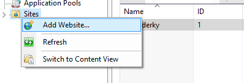

# Table of Contents
1. [PURPOSES](#PURPOSES)
2. [CONTENT](#CONTENT)
3. [REFERENCES](#REFERENCES)
4. [BRAIN STORMING](#BRAIN-STORMING)

## PURPOSES

This tutorial shows how to deploy an ASP.NET web application to IIS using `File System` publishing method.

There are 3 methods to publish your ASP.NET Web Application: 
* Web Deploy
* Web Deploy Package
* FTP
* File System

In this tutorial I will guide you to use `File System` to publish your web application.


## CONTENT
### 1. How Web Server working?

> A web server is a computer system that processes requests via HTTP
>
> *(wikipedia)*

IIS is a web server, It receive your request via HTTP protocol and reponse a result to you.

    
```
[Users] --- request ---> [IIS port 80/443] ---- request ---> [Application]
   ^                                                              '
   '------  result ----- [IIS port 80/443] <--- result -----------'
             
```

IIS will use port 80 or 443 (by default) and waiting for a request.

If IIS receive a request It will pass that request to your allication, and IIS continue to waiting for a response from your application.

After getting a response from your application, IIS will send that result to user.

### 2. Install IIS 

* You need to install IIS first. To install IIS on your Windows Server, you can follow this instruction:

  [https://www.iis.net/learn/get-started/whats-new-in-iis-8/installing-iis-8-on-windows-server-2012](https://www.iis.net/learn/get-started/whats-new-in-iis-8/installing-iis-8-on-windows-server-2012)

* Then you have to add `ASP.NET 4.5` (or ASP .NET 3.5) to your IIS: 
  
  [https://www.iis.net/learn/get-started/whats-new-in-iis-8/iis-80-using-aspnet-35-and-aspnet-45](https://www.iis.net/learn/get-started/whats-new-in-iis-8/iis-80-using-aspnet-35-and-aspnet-45)


### 3. Add a Web-Site in IIS

**Step 1**: Open IIS

<center>
    
</center>

**Step 2**: Add new Web Site

<center>
    
    <br />
    <i>(Right click to "Sites" and choose "Add Website")<i>
</center>
 
<br />

<center>
    
    <br />
    <i>(Input your website configurations)<i>
</center>


* **Site name**: Display name in IIS

* **Physical Path**: This is where your `publishing files` take place. After publish your application into `publishing files`, you copy all of them to this directory.
* **Type & Port**: Define which protocol your website uses. If you choose HTTP your port must be 80, and port 443 for HTTPS.

  You can change default port (80,443) to whatever you like, but I don't encourage to do that. 

* **Host name**: Specific the host name of your website.

  By default, Each website will run in seperated port. If website A run on port 80, then Website B can't run on port 80 anymore, because this port is used by A.
  
  There is a method called `Virtual hosting`. Virtual hosting is a method for hosting multiple webstie on the same port. 
  
  And `Host name` help you to implement `Virtual hosting` in IIS.


After add my website, my website will be placed in `C:\inetpub\wwwroot\coderky`


### 4. Build & publish your app into `publishing files`

**Step 1:** In visual studio, right click on your Project, and choose `Publish`

<center>
    
    <br />
</center>

**Step 2:** Create a publish profile
<center>
    
    <br />
    <i>(Create a custom publish profile)</i>
</center>

<br />

<center>
    
    <br />
    <i>(Type your profile name)</i>
</center>

<br />

<center>
    
    <br />
    <i>(Choose `File System` method )</i>
</center>

<br />

<center>
    
    <br />
    <i>(`Target location` is the path where your `app content` take place after publishing )</i>
</center>


After publishing my application, all `publishing files` will be placed in `C:\Published\Web`

<center>
    
    <br />
    <i>(Publishing files)</i>
</center>

### 5. Push your application to Web Server.
In previous section (Build & publish your app into `publishing files`). You already know how to build your app into `publishing files`.

Now, you have to push these files to your web server. It very simple.

Copy your all `publishing files` from

> C:\Published\Web
>
> (This path was configured in section `Build & publish your app into publishing files` )

To

> C:\inetpub\wwwroot\coderky
>
> (This path was configured in section `Add a Web-Site in IIS` )


### 5. Start & run your app.


<center>
    
    <br />
    <i>(Start your website )</i>
</center>

<br />

<center>
    
    <br />
    <i>(Browse your website )</i>
</center>


## REFERENCES


## BRAIN STORMING

1. Do you know what is IIS ?
2. Why we need IIS to publish your Application ?